# 图神经串讲

* [图神经串讲](https://kg-nlp.github.io/Algorithm-Project-Manual/图神经/图神经串讲.html)
* [个人知乎](https://www.zhihu.com/people/zhangyj-n)

[TOC]

  

## **一 串讲论文**

| **论文**         | **前沿及算法解决问题**                                       | **论文创新点**                                               | **重点内容**             |
| ---------------- | ------------------------------------------------------------ | ------------------------------------------------------------ | ------------------------ |
| Node2vec         | 与PCA、ISOMAP、deepwalk对比，使用更灵活的搜索策略，得到更好的节点表征效果 | Biased random-walk 算法，参数p/q选取，alias samling方法，BFS/DFS搜索策略 | 游走方式图+公式          |
| LINE             | 维护局部和全局网络结构                                       | 根据图的信息直接建模不急于随机游走大规模数据集上的应用一阶相似度、二阶相似度 | 概念                     |
| SDNE             | 使用深层模型，解决非线性、结构保存、稀疏性问题               | 一阶相似度做有监督，二阶相似度做无监督，结合自编码与网络表征算法；基于半监督的多层神经网络框架 | 网络图结构               |
| **TransE/H/R/D** | 对于多关系数据的建模，将实体和关系映射到低维空间             | TransE : 关系在一个平面；TransH:关系在一个超平面；TransR:关系在一个异空间；TransD是对R的改进，减少参数 | 关系映射关系             |
| **Metapath2vec** | 异构网络，多类型的边和点                                     | 规定meta paths 人为定义的有意义的路径，随机游走时按这些路径获取序列。++算法 在softmax的时候针对一样的类型做的softmax，也就得到了最后不**同类**型的向量表示 | 路径定义，向量如何表示   |
| **GCN**          | 将卷积操作应用到图上（使用图卷积神经网络建模），通过图频域的近似分析来建模，学习图的局部结构和节点特征 | 提出了一个两层的GCN模型，设计了一个半监督的loss函数          | 空域公式，及GCN应用      |
| GraphSAGE        | 图卷积神经网络，做图的归纳式学习，通过学习一组函数节点的邻居采样然后汇聚得到向量示的表达 | 提出不同的aggregator模型结构，算法的目的也是训练aggregate函数，还提出了批量训练的方法 | 空域公式，及聚合函数设计 |
| RGCN             | 利用GCN来处理图结构中不同边关系对节点的影响                  | 将GCN框架应用于关系数据[建模](https://www.zhihu.com/search?q=建模&search_source=Entity&hybrid_search_source=Entity&hybrid_search_extra={"sourceType"%3A"article"%2C"sourceId"%3A157902271})，特别是链路预测和实体分类任务。对于链路预测任务，通过在关[系图](https://www.zhihu.com/search?q=建模&search_source=Entity&hybrid_search_source=Entity&hybrid_search_extra={"sourceType"%3A"article"%2C"sourceId"%3A157902271})中的多个推理步骤中使用编码器模型来积累信息，可以显著改进链路预测的模型；对于实体分类任务，则是类似于GCN论文中，即对每个节点使用一个softmax分类器，通过R-GCN来提取每个节点表示用于节点类[别的预测。](https://www.zhihu.com/search?q=softmax分类器&search_source=Entity&hybrid_search_source=Entity&hybrid_search_extra={"sourceType"%3A"article"%2C"sourceId"%3A157902271}) |                          |
| GAT              | 图卷积神经网络，在节点特征从邻居汇聚的时候考虑权重，适用于直推式和归纳式 | 应用注意力机制考虑邻居权重                                   | 空域公式，及聚合函数设计 |
| **MPNN**         | 提出化学分子上的监督学习具有研究意义，使用图神经网络进行化学分子性质预测 | 提出了一个统一的消息传递和信息汇合的框架，将GGNN、GCN等模型归入到统一的MPNN框架 |                          |

## **二 embedding获取方式**

1 通过图（graph）结构里的遍历，生成节点的序列，来创造“句子”语料，然后再利用Word2Vec的思想

2 用周围节点来编码中心节点，相当于通过训练一个虚拟网络（Network），把每个节点周围的结构信息储存在了这个虚拟网络（Network）里，而输入周围节点后这个网络输出的向量，正是这个中心节点的embedding。

## **三 图卷积**

### **3.1 图像卷积与图卷积区别**

统卷积的**图像(欧式空间)**与**图(非欧空间)**的区别：

如果把图像中的每个像素点视作一个结点，如下图左侧所示，一张图片就可以看作一个非常稠密的图；下图右侧则是一个普通的图。阴影部分代表**卷积核**，左侧是一个传统的卷积核，右侧则是一个图卷积核

​    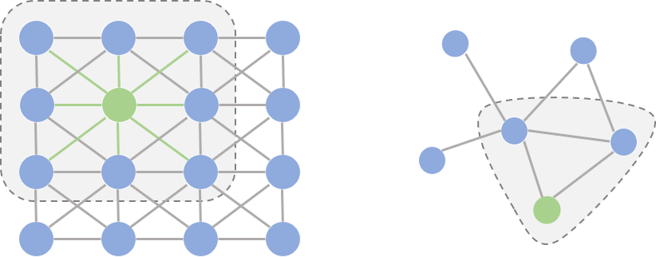

仔细观察两个图的结构，我们可以发现它们之间有2点非常不一样：

- 在图像为代表的欧式空间中，结点的邻居数量都是固定的。比如说绿色结点的邻居始终是8个(边缘上的点可以做Padding填充)。但在图这种非欧空间中，结点有多少邻居并不固定。目前绿色结点的邻居结点有2个，但其他结点也会有5个邻居的情况。
- 欧式空间中的卷积操作实际上是用**固定大小可学习的卷积核**来抽取像素的特征，比如这里就是抽取绿色结点对应像素及其相邻像素点的特征。但是因为图里的邻居结点不固定，所以传统的卷积核不能直接用于抽取图上结点的特征。

真正的难点聚焦于**邻居结点数量不固定**上。目前主流的研究从2条路来解决这件事：

- 提出一种方式把非欧空间的图转换成欧式空间。
- 找出一种可处理变长邻居结点的卷积核在图上抽取特征。

这两条实际上也是后续图卷积神经网络的设计原则，**图卷积**的本质是想找到**适用于图的可学习卷积核**。

### **3.2 图卷积框架**

如下图所示，输入的是整张图，在Convolution Layer 1里，对每个结点的邻居都进行一次卷积操作，并用卷积的结果更新该结点；然后经过激活函数如ReLU，然后再过一层卷积层Convolution Layer 2与一层激活函数；反复上述过程，直到层数达到预期深度。与GNN类似，图卷积神经网络也有一个局部输出函数，用于将结点的状态(包括隐藏状态与结点特征)转换成任务相关的标签，这种任务为Node-Level的任务；也有一些任务是对整张图进行分类的，这种任务为Graph-Level的任务。**卷积操作关心每个结点的隐藏状态如何更新**

  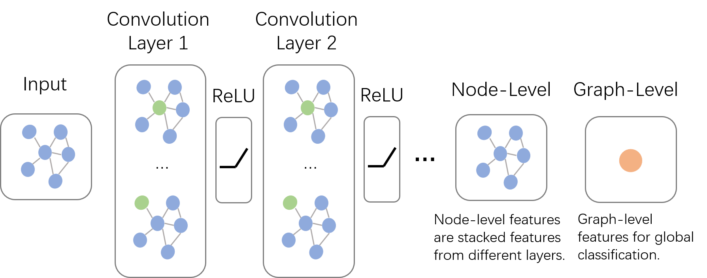

> 注意GCN是多层堆叠，比如上图中的Layer 1和Layer 2的参数是不同的；GNN是迭代求解，可以看作每一层Layer参数是共享的。

## **四 空域和频域**

图卷积神经网络主要有两类，一类是基于**空域**的，另一类则是基于**频域**的。通俗点解释，空域可以类比到直接在图片的像素点上进行卷积，而频域可以类比到对图片进行傅里叶变换后，再进行卷积。

### **4.1 空域卷积**

从设计理念上看，空域卷积与深度学习中的卷积的应用方式类似，其核心在于**聚合邻居结点的信息**。比如说，一种最简单的无参卷积方式可以是：将所有直连邻居结点的隐藏状态加和，来更新当前结点的隐藏状态。

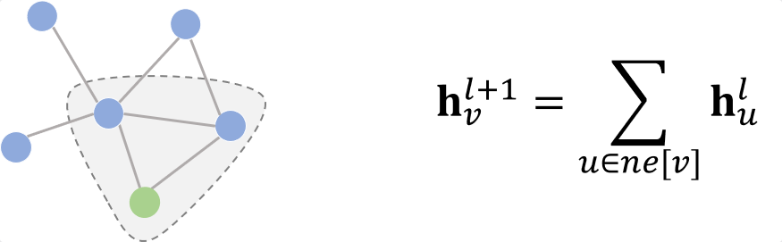

### **4.2 消息传递网络(Message Passing Neural Network)**

消息传递网络(MPNN) 是由Google科学家提出的一种模型。严格意义上讲，MPNN不是一种具体的模型，而是一种空域卷积的形式化框架。它将空域卷积分解为两个过程：**消息传递**与**状态更新**操作

 

  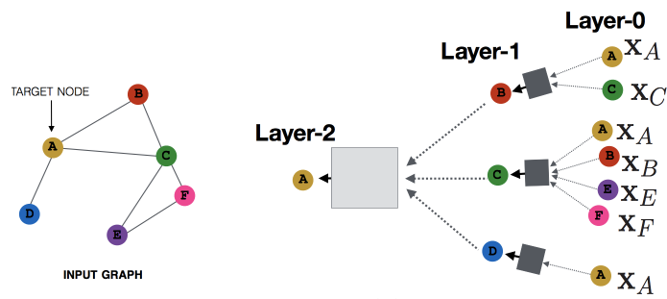

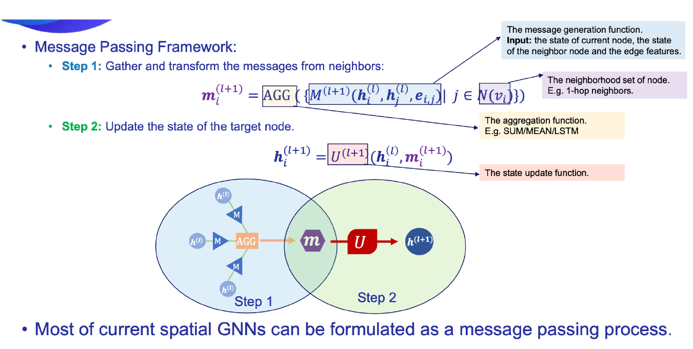

> 定义在这个框架下的所有模型都有一个共同的缺陷：卷积操作针对的对象是**整张图**，也就意味着要将所有结点放入内存/显存中，才能进行卷积操作。但对实际场景中的大规模图而言，整个图上的卷积操作并不现实。GraphSage提出的动机之一就是解决这个问题。从该方法的名字我们也能看出，区别于传统的全图卷积，GraphSage利用**采样**(Sample)部分结点的方式进行学习。当然，即使不需要整张图同时卷积，GraphSage仍然需要聚合邻居结点的信息，即论文中定义的*aggregate*的操作。这种操作类似于MPNN中的**消息传递**过程。
>
> 具体地，GraphSage中的采样过程分为三步:
>
> 1 在图中随机采样若干个结点，结点数为传统任务中的batch_size。对于每个结点，随机选择固定数目的邻居结点(这里邻居不一定是一阶邻居，也可以是二阶邻居)构成进行卷积操作的图。
>
> 2将邻居结点的信息通过*aggregate*
>
> 3函数聚合起来更新刚才采样的结点。
>
> 4计算采样结点处的损失。如果是无监督任务，我们希望图上邻居结点的编码相似；如果是监督任务，即可根据具体结点的任务标签计算损失。
>
> 最终，GraphSage的状态更新公式如下：

> GraphSage的设计重点就放在了*aggregate*函数的设计上。它可以是不带参数的*max*, *mean*, 也可以是带参数的如*LSTM*等神经网络。核心的原则仍然是，它需要可以处理变长的数据

### **4.3 频域卷积**

空域卷积非常直观地借鉴了图像里的卷积操作，但它缺乏一定的理论基础，而频域卷积则不同，相比于空域卷积而言，它主要利用的是**图傅里叶变换(Graph Fourier Transform)**实现卷积。简单来讲，它利用图的**拉普拉斯矩阵(Laplacian matrix)**导出其频域上的的拉普拉斯算子，再类比频域上的欧式空间中的卷积，导出图卷积的公式。虽然公式的形式与空域卷积非常相似，但频域卷积的推导过程却有些艰深晦涩。

## **五 论文串讲**

### **5.1 Node2vec 大规模网络节点的表征学习 2016**

#### **5.1.1 BFS/DFS**

   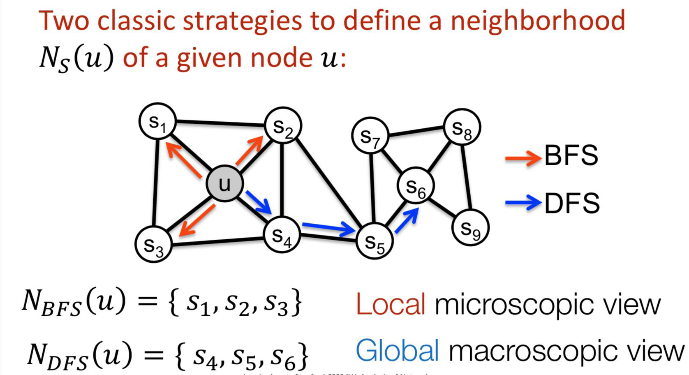

BFS：结构相似性；比如u和s6

DFS：同质、社群相似性

#### **5.1.2 有偏随机游走**

**传统随机游走**

   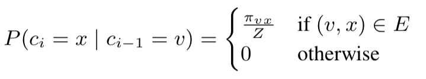

无权图Wvx = 1

Z:将概率归一化

**有偏随机游走**

 

dtx: t/x之间的最短路径

dtx:{0,1,2}

p/q 超参数，控制从V点离开邻居的快慢

假设当前时刻是v,上一时刻为t,则v走向下一个的可能性，由上一时刻t走向v邻居大小决定。

p值大，倾向不回溯，p值小，倾向回溯，采样序列在起始点周围；

q>1 bfs策略

q<1 dfs策略

### **5.2 LIINE 大规模信息网络特征 2015**

#### **5.2.1一阶相似度定义**

直接邻居（点之间是否有边），无向网络

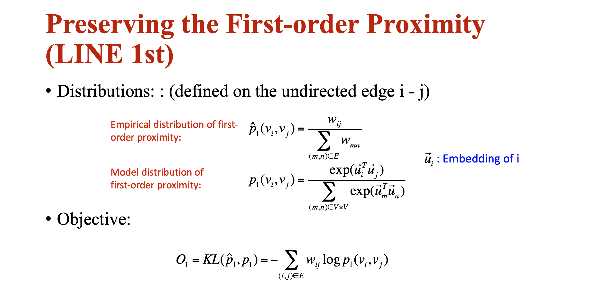

真实值：权重softmax，分母是所有边，计算权重和

预测值：每个节点embedding内积 softmax ，分母是所有点

目标函数：KL散度 计算邻居相似度

#### **5.2.2 二阶相似度**

邻居间的相似度

有向网络

 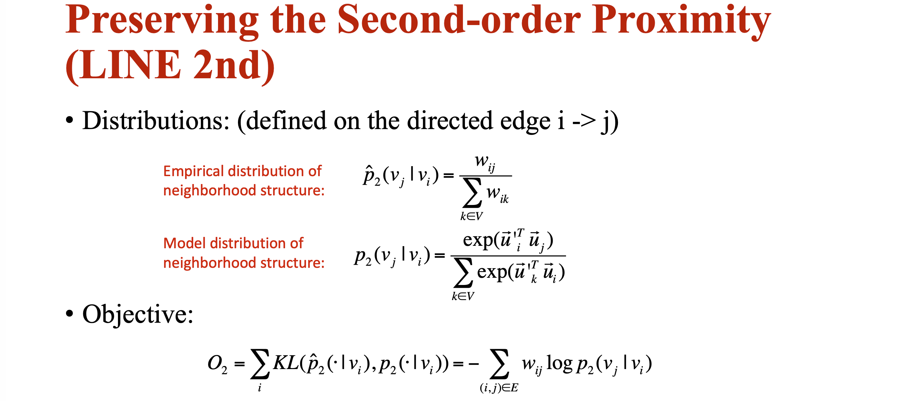

真实值：分母固定i 计算i的出度

预测值：分母固定i

目标函数：KL散度

### **5.3 SDNE 结构化深度网络特征表示 2016**

SDNE中的相似度定义和LINE一样

使用自动自编码器同时优化一阶和二阶相似度（LINE分别优化）

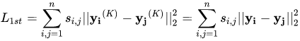

sij: i和j之间是否存在边，yi理解为第k层的隐层输出即embedding，一阶损失函数，目的学习两个节点的相似性

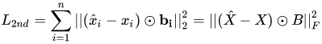

xi:输入的二阶相似度，最后目标是还原二阶相似度向量

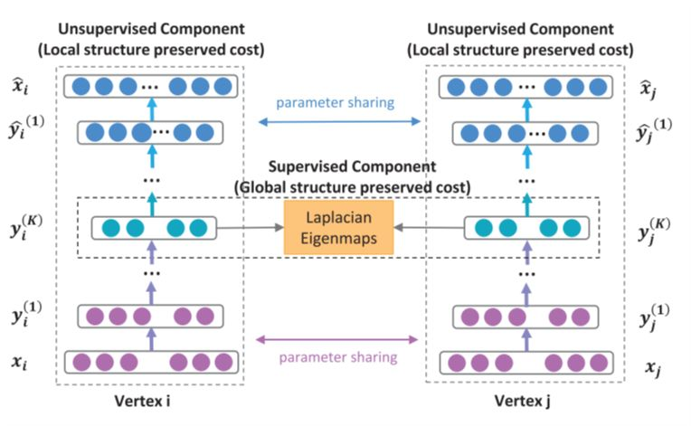

### **5.4 TransE/H/R/D 知识图谱向量化表示 2013**

应用到多种关系的向量表示，之前的论文只对节点进行embedding操作

Trans系列算法思想

把三元组(h,r,t)都映射到一个D维空间中，并使得三元组中的三个向量满足如下图所示的关系，就是

   

​    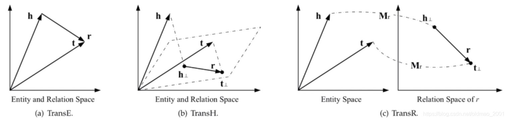

#### **5.4.1 transE**

只能解决节点间关系为1对1的关系

#### **5.4.2 transH**

解决TransE存在的问题：1to many，many to 1，many to many

主要思路：entity在不同的关系上有不同的embedding

实现方式：不同的关系在hyperplane（超平面）的映射不一样

实体和不同实体之间可以存着同种或多种关系，只需要映射到不同的关系超平面即可

  

#### **5.4.3 TransR**

解决TransE/TransH存在的问题：relation与entity由于是不同类型的点，可能存在于不同的空间。映射到超平面仍然是在相同空间中。

主要思路：将entity映射到relation的空间上

实现方式：矩阵映射

#### **5.4.4 TransD**

解决TransR问题：映射只由relation决定，实体的映射应该由实体和关系共同决定；矩阵操作计算复杂度高，进行优化

### **5.5 Metapath2vec 异质网络的大规模特征表示 2017**

基于meta-path的random walks来构建每个顶点的异构邻域，然后用Skip-Gram模型来完成顶点的嵌入

meta-scheme:路径为对称，意在通过特殊的随机游走方式获取不同类型节点间的语义关系

metapath2vec++：通过softmax将不同类型的节点进行区分

### **5.6 GCN 图卷积神经网络的半监督分类 2017** 

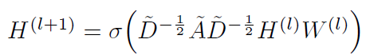

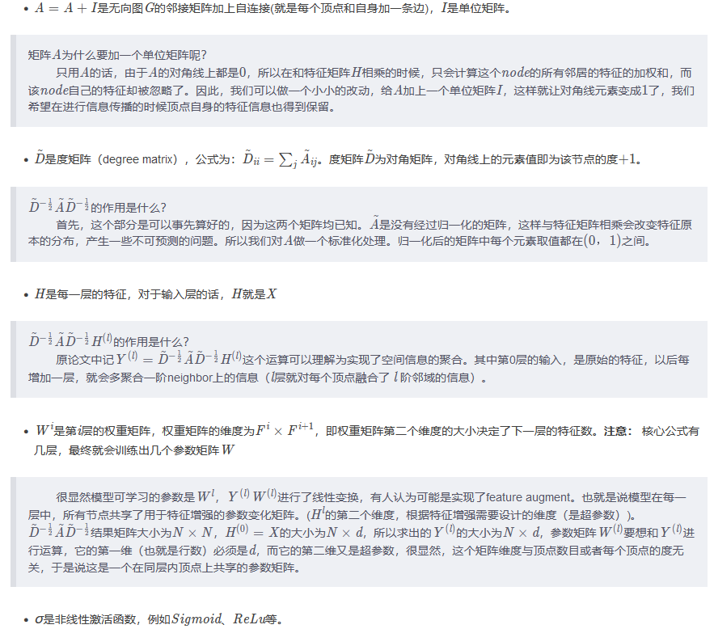

   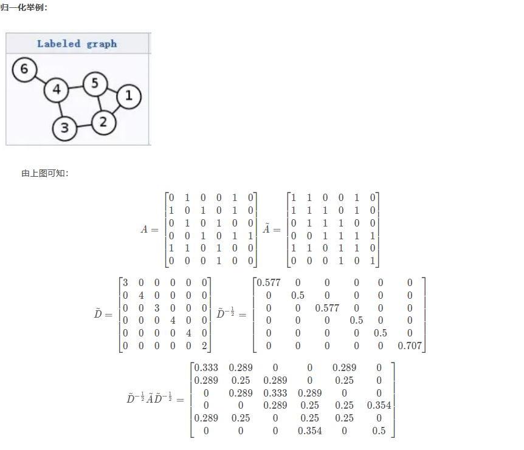

​    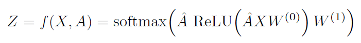

### **5.7 GraphSAGE 大规模网络归纳式学习 2018**

 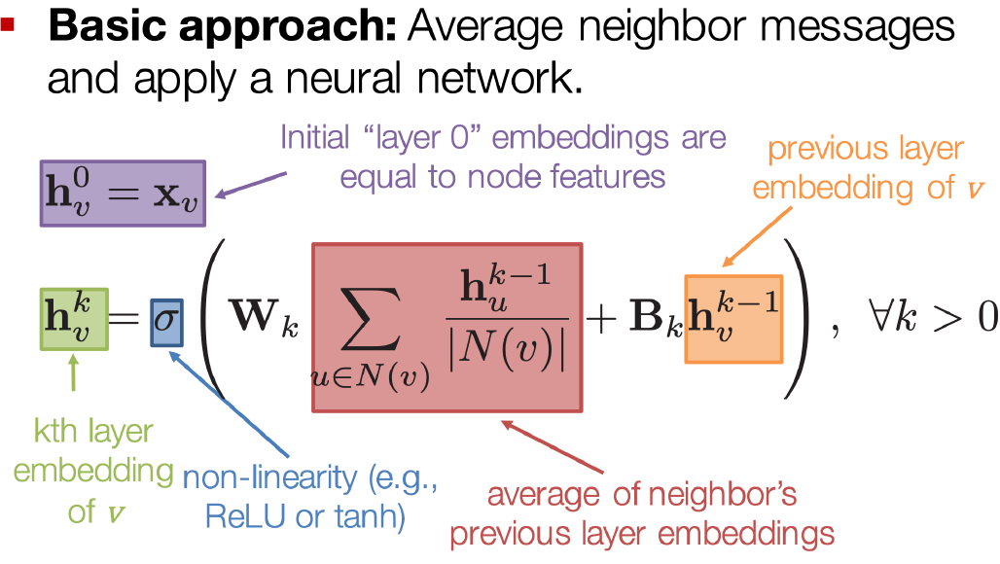

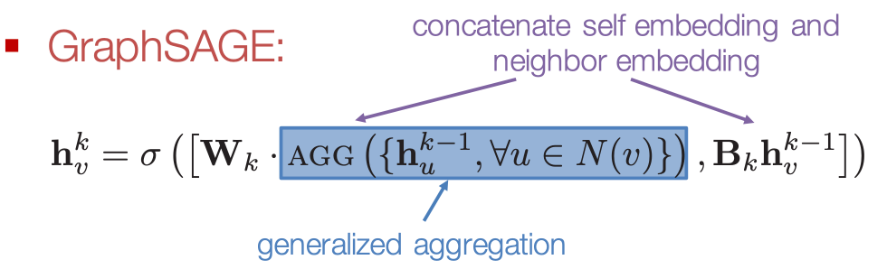

  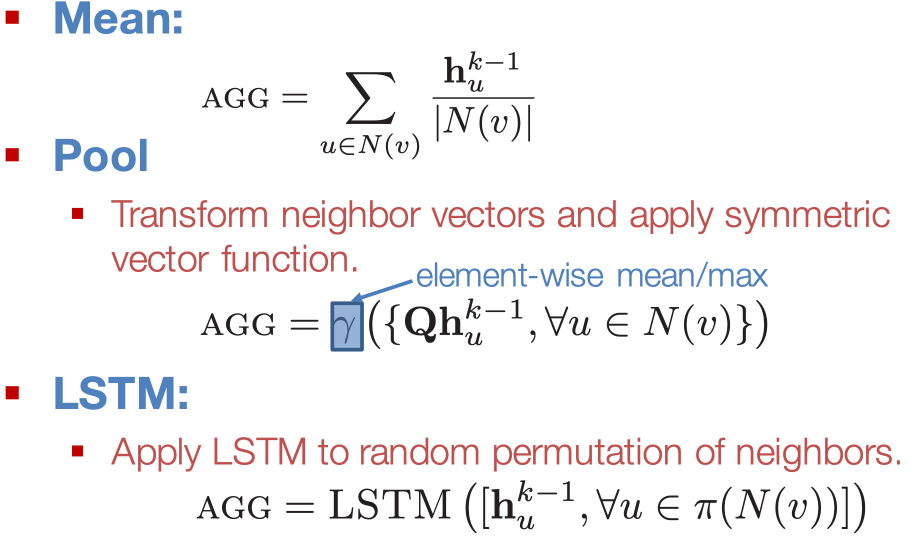

### **5.8 GAT 图注意力网络 2018**

 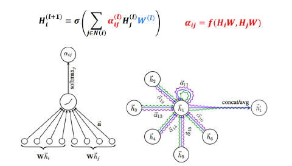

 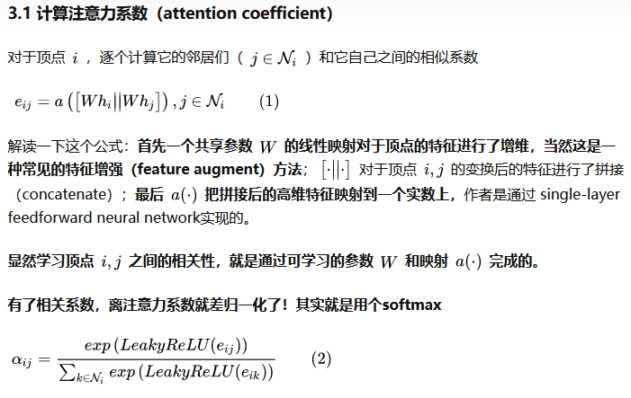

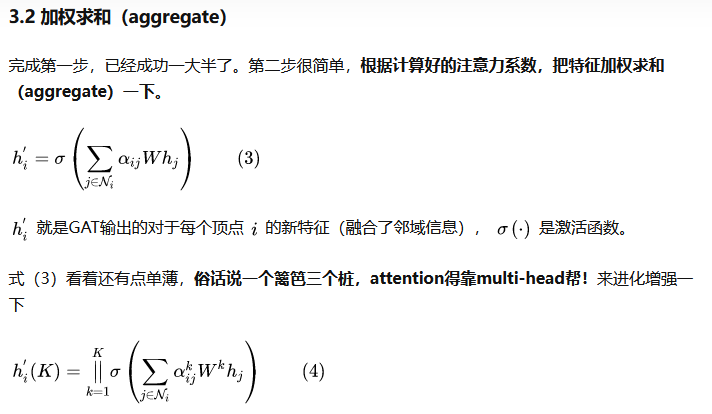

### **5.9 MPNN 神经网络消息传递应用量子化学 2017** 

从网上找到一张概括类的图

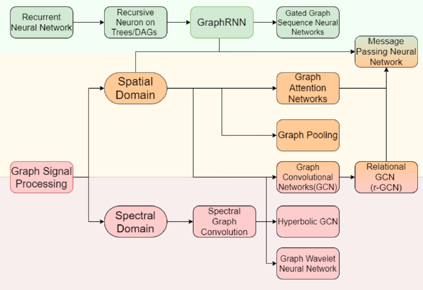

## 参考

https://zhuanlan.zhihu.com/p/81350196

https://blog.csdn.net/qq_41987033/article/details/103532624

https://github.com/SivilTaram/Graph-Neural-Network-Note

https://blog.csdn.net/qq_41995574/article/details/99712339

https://www.bilibili.com/video/BV1c4411c7KM?from=search&seid=10659573000782635832
