# DB-GPT调研

*   [算法开发手册](https://kg-nlp.github.io/Algorithm-Project-Manual/大模型/DB-GPT调研.html)

*   [个人知乎](https://www.zhihu.com/people/zhangyj-n)


[toc]

# **背景**

1. **了解DB-GPT 功能及应用**

2. **通过关联框架了解DB-GPT处理逻辑,如FastChat**

3. **了解基于LLM的知识库问答和EXCEL问答分析**

 

> 想着通过这些资料了解下DB-GPT源码结构,结果是我肤浅了,之前没有做过LLM相关的知识问答,chat相关的框架没有接触过,读完下面的资料发现还得看看FastAPI和FastChat,万里长征才迈出了一步.

 

# [**92%的准确率！如何利用DB-GPT在业务场景下打造企业级的知识库问答系统**](https://www.bilibili.com/video/BV1sN411J7cv/?spm_id_from=333.1007.top_right_bar_window_custom_collection.content.click&vd_source=a9f595e4b26bcb66fef9c3acae4fc4fd)

## **PPT介绍**

### **Cvp**

1. C是以ChatGPT为代表的大语言模型，现在表现最好的通用LM是GPT-4,两者都是属于OpenAl公司的产品，但是GPT-4的价格是ChatGPT3.5的20倍。本地LLM表现比较好的是百川智能在近期发布的Baichuan2-13B-Chat。我们建议，在知识库问答场景，如果不涉及隐私数据，可调用ChatGPT-3.5,涉及隐私数据时，可基于DB-GPT本地部署Baichuan2-13B-Chat来做推理。

2. V是(Vector Database)向量数据库的缩写。区别于传统的数据库，向量数据库专门存储和管理向量数据，通常采用基于向量索引的存储方式，将向量数据映射到高维空间中，并在这个空间中构建索引结构，以支持高效的相似度查询。

3. P即Prompt,但是这里的Prompt不单指LLM的提示词，更广义地表示提示工程和产品交互部分。Prompt包括zero-shot、one-shot跟few-shot三类，一般情况下，few-shot的效果要明显好于前两者。

 

***\*为什么是CVP\****

企业借助LLM能力提升生产力是目前LLM落地的一个重要方向。围绕这个方向的探索大致分为两大流派：传统流派将垂域内容、私域内容补充到数据集里，微调甚至重训LLM,希望模型具有端到端的能力，即单模型架构；新兴流派则引入了向量数据库为LLM提供长期记忆，采用通用LLM集成领域知识库的方案来提供服务，即CVP架构。

相比于单模型架构，CVP架构在可扩展性、实时性和成本三个维度都有明显优势。

1. 传统流派需要将垂域、私域内容更新到模型参数中，需要微调LM,需要花费大量的计算资源，同时需要专业的同学去完成这个工作，但是结果不稳定，有可能花费数周都无法微调出一个令人满意的模型，甚至是负优化。这个过程也被形象地比喻为“炼丹”!

2. 新兴流派引入了向量库为LM补充一个外部记忆体，存储垂域、私域的知识。不需要微调LLM,只需要将实时知识添加到向量库中即可完成知识的更新，而非微调LLM。

我们在AI问答助手产品的落地中发现，即使CVP架构依赖于本地部署的Baichuan2-13B-Chat,其问答效果也可以显著超过GPT-4的单模型架构。当然这套架构的核心是垂域、私域知识库的构建，知识库的质量直接决定了CVP架构的问答效果。

 

 

 

### **Flowchart**

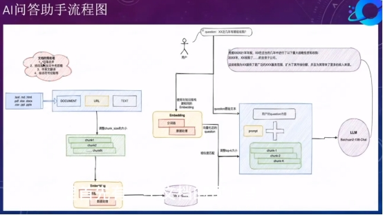 

### **Document preprocessing**

即在文档上传知识库之前做的文档预处理工作。预处理工作的准则是，能系统化的步骤则系统化，不能系统化的步骤按照SOP人工处理之后，需要达到入知识库的标准。不满足标准的文档不允许入库。文档预处理阶段核心要考量的点：

1. 文档语言统一：我们在构建知识库时发现，有的文档是中英文结合的，例如，同一行中左边是中文(简体)、右边是英文，这种需要删掉英文，只保留中文(简体);如果是中文(繁体),则需要转成中文(简体);如果文档是英文，则需要转成中文(简体)。

2. 文档格式统一：我们测试发现，相比于.pdf格式，docx格式的效果更好，推荐使用该格式，需要将.pdf格式转换成.docx格式。

·文档命名规整：文档名应控制在10字左右，使用简洁明了的词语或短语来命名文档，避免使用无意义的数字、符号或缩写。

a【good case】20221220-中央经济工作会议解读

b【bad case]

20221220-英大证去人工处理之后期总第120期):2022年中央经济工作会议解读，基建投资大概率是207学同比大概率总体上行

 

 

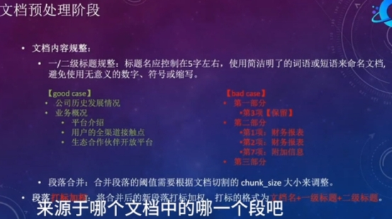 

### **chunk size**

chuncksize参数控制每个切割块的字符长度。简单的调整可直接调整该参数的大小，还可调整文档切割的方法，目前我们使用的是zh_core_web_sm

### **Embedding**

评估指标：一般采用Top5的召回准确率和Top10的召回准确率

### **Vector**

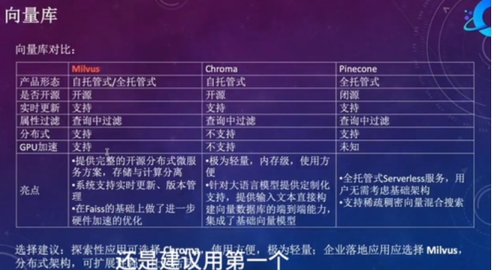 

### **Recall**

召回TOP-K

K的选择：文档内容足够丰富时(文档数>10),调大该值；文档内容比较少时，调小该值。

### **Prompt**

知识库问答场景下的prompt工程相对比较简单，不同知识库固化一个当前知识库通用的prompt即可。

### **Model**

对于中文知识库问答来说，目前表现最好的开源LLM是Baichuan2-13B-Chat,上面我们也提到，在CVP架构中，我们不需要太强的LLM,就可以有很好的效果，我们以Baichuan2-13B-Chat作为本地LM,在Al问答助手场景中，可以获得85%以上的准确率。

 

### **Theory**

在构建Al问答知识库时，最开始我们将所有的文档都放到了一个知识库中，包括宏观政策、经济和行业调研分析的文档，但是发现效果并不好，研究badcase发现，用户问宏观政策环境问题时，会召回财报中讲述宏观政策环境对企业经营的影响。用户问某个企业的经营状况时，又会召回很多宏观政策经济的内容，知识互相揉杂，导致不准确。后续我们又拆成了3个知识库，效果有了明显改善，研究badcase发现，用户对于宏观政策库、经济库的问题，往往需要结合宏观政策和经济材料才能完美回答，我们研究材料发现确实如此宏观政策中夹带经济，经济中夹带宏观政策，所以我们最后建了两个库：宏观库和行业库。效果达到了最优，问答准确率达到了92%。

在尝试划分知识库的时候，我们也发现，知识库构建遇到的问题，答案基本都能在数仓建模中找到，上述的案例其实是数仓建模分主题域的理论：域内高内聚、域间低耦合。推广到知识库的分知识库理论为：库内高内聚、库间低耦合。

### **results**

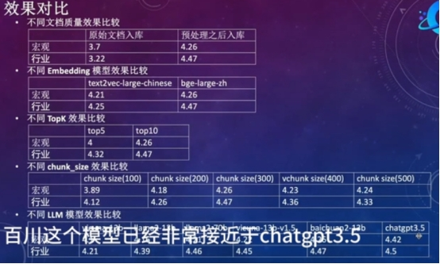 

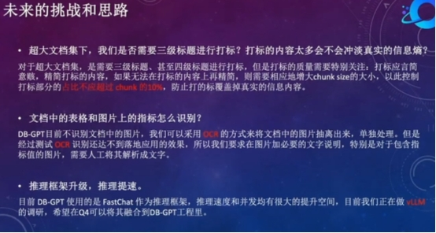 

 

# [LLM实战系列(1)—强强联合Langchain-Vicuna应用实战](https://zhuanlan.zhihu.com/p/628750042)

## **本地化部署架构**

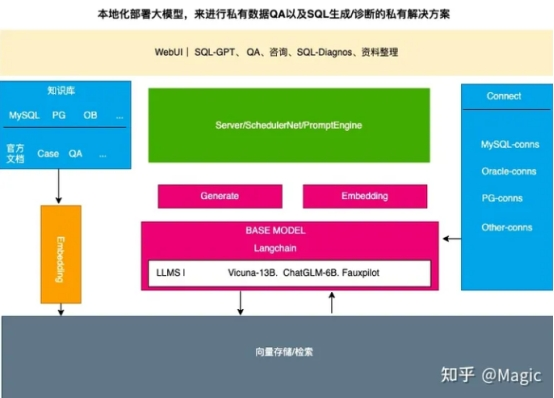 

 

## **知识库处理流程**

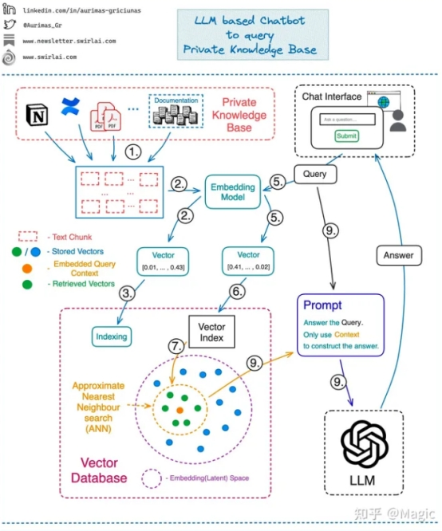 

 

 

 

# [DB-GPT: 一个隐私的数据库垂直领域本地化大模型框架](https://zhuanlan.zhihu.com/p/629998078)

## **DB-GPT核心能力**

 

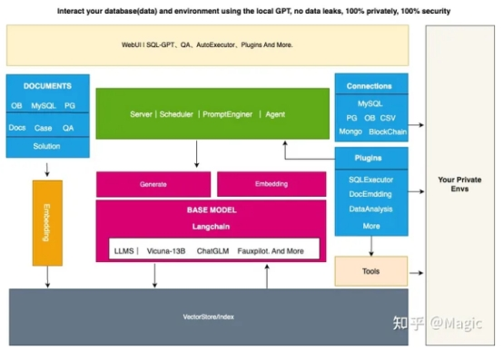 

核心能力主要有以下几个部分。

1. 知识库能力：支持私域知识库问答能力

2. 大模型管理能力：基于FastChat提供一个大模型的运营环境。

3. 统一的数据向量化存储与索引：提供一种统一的方式来存储和索引各种数据类型。

4. 连接模块：用于连接不同的模块和数据源，实现数据的流转和交互。

5. Agent与插件：提供Agent和插件机制，使得用户可以自定义并增强系统的行为。

6. Prompt自动生成与优化：自动化生成高质量的Prompt，并进行优化，提高系统的响应效率。

7. 多端产品界面：支持多种不同的客户端产品，例如Web、移动应用和桌面应用等。

 

# [垂域LLM应用实践](https://zhuanlan.zhihu.com/p/639359512)

## **Text2SQL**

 

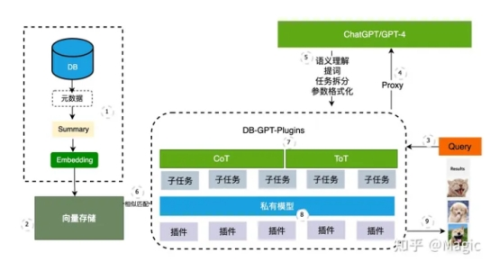 

 

关键技术: 1. Summary + Embedding 2. 大帮小 3. CoT+ToT(复杂任务拆步解)

### Summary + Embedding

对库、表、字段、索引进行简要的Summary，我们即可做到让大模型理解我们的元数据，理解我们的业务语义。

### 大帮小

面临复杂任务: 普通模型很难理解,因此我们会根据Query + Summary的内容让大模型先完成语义提取。 将复杂问题的理解，格式化输出一个固定的ToT的模版内容，将复杂的任务拆解为几个独立的简单步骤。

 

在此之后，我们将每个小步的任务丢给小模型去处理。 当然在这个环节，我们为了更稳定的效果，还需要跟大模型完成一些交互

 

```
RESPONSE_FORMAT = {

"thoughts": {

"reasoning": "reasoning",

"speak": "thoughts summary to say to user",

},

"sql": "SQL Query to run",

}
```


 

### CoT/ToT

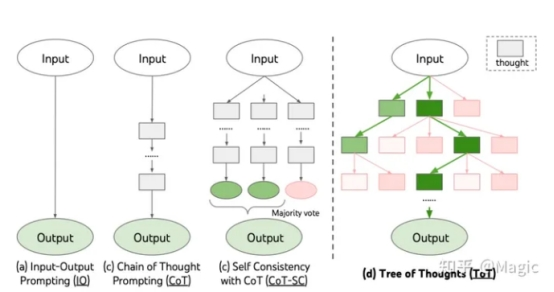 

 

思维链以及思维树，已经是业界非常流行的方案了。 尤其在插件使用上，思维链模型应用非常广泛，其中Auto-GPT整个推理过程就大量使用了思维链进行反复推理，来生成最终正确的结果。

## **总结**

综合考虑成本、隐私、效果制定的一个折中方案。 

核心数据资产通过本地化Embedding模型，Summary之后存储在私有向量数据中。 

用户复杂的问题通过DB-GPT Proxy转接给中心化大模型做语义识别与任务拆解。

拆解完成的小任务，通过DB-GPT中的私有化大模型完成具体的任务执行。

最后结果通过思维链/思维树的路径进行多轮验证来确保得到准确的结果。

# [基于DB-GPT与Google Bard构建知识库问答系统](https://zhuanlan.zhihu.com/p/647270538)

## **知识库架构**

直接通过ICL方式进行学习

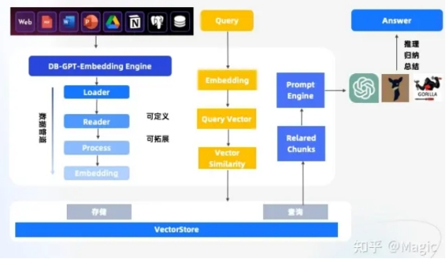 

 

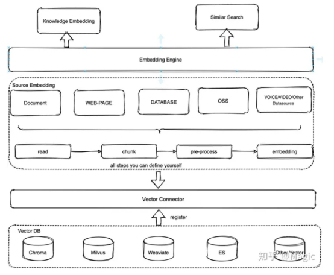 

 

### embedding engine层

知识embedding客户端，包括如何将文档知识knowledge_embedding方法导入向量数据库以及通过similar_search方法根据用户提问向量检索出相似度高的知识片段

```
document_path = "your_path/test.md"

embedding_engine = EmbeddingEngine
```

### knowledge source层

提供根据不同知识类型进行读取->切片->数据处理->转向量的pipeline， 每一步可以按照默认的实现方式，也可以可自定义的进行个性化处理。 此层具备一定的拓展性，能够不断地扩展知识类型，包括但不限于文档、视频、音频、数据库、数仓、对象存储等等。扩展方法都是通过继承SourceEmbedding然后按需实现


```
read()->data_process()->index_to_store()  整个PipeLine

· read():知识的加载解析，这里可以使用langchain的各种Loader,也可以自定义Loader进行实现。

· data_proccess():数据预处理，可以按照自定义逻辑进行数据处理。

· index_to_store():存入向量数据库，通过vector_store_config配置向量数据库连接参数

class SourceEmbedding(ABC):
```


### vector connector层

主要提供知识向量和向量数据库交互的能力，每一种具体的向量数据库注册到vector connector，让用户并不感知具体向量数据库的实现底层细节。同样地vector connector底层目前也只实现了Chroma, Milvus, Weaviate向量数据库，更多的向量数据库也可以通过横向扩展注册到vector connector中。

 

```
· load_document():加载文档导入到向量数据库

· similar_search():文档相似性搜索

· vector_name_exists:判断向量数据库名是否已存在

class VectorStoreConnector:
```


### **不足和改进**

当前DB-GPT在知识问答效果上具备了知识库问答的能力，并提供了通用的底层模块，对于相对简单的问答场景，有较好的表现。但是在稍微复杂的问答场景上面，效果还比较差，主要体现在:

l 直接将问题 + 相似性搜索出文档当作上下文，常常由于提出问题的模糊性搜索出匹配不相关的文档。这些不相关的文档会让模型推理出的答案有误。比如

Q：问题MySQL支持哪些时间函数？

A: 除了时间函数还有其他函数。

这里有个思路就是准备一个问题集与答案集，将问题集向量化到向量数据库，根据用户提供的问题从问题集检索到最贴近的几个问题，然后获取每个问题集对应的答案，再将问题和答案交给大模型进行推理总结，这种方案的优点：能够一定程度提高模型答案的准确性，能够解决问题模糊性带来不相干文档的干扰。缺点：需要预先准备大量的问题集和答案集。

l 对于一些复杂问题比如多知识点的比较问答，比如：

Q: 对比MySQL、OceanBase分别在部署架构、事务以及高可用上面的优缺点？

如果直接根据初始问题进行Embedding然后进行向量检索出知识片段然后再丢给模型推理，效果非常不理想，尤其是在开源大模型上的表现。其中一种可选的思路是将问题进行拆解，也可以说关键词提取，通过拆解的关键词分别进行向量检索，比如可以拆解成MySQL部署架构的优缺点，MySQL事务优缺点，MySQL高可用优缺点，OceanBase部署架构的优缺点，OceanBase事务优缺点，OceanBase高可用优缺点。

将拆解后的问题进行embedding后通过大模型推理出每个问题的答案，然后再将初始问题和拆解后的问题+答案一起再丢给大模型进行推理出最终答案。这里的涉及到的难点就是问题拆解以及多轮模型对话的交互，围绕以上问题我们也正在基于CoT、ToT这样的技术手段来构建工程化的能力。

 

l 目前开源模型回答还不够稳定。

这个问题是开源大模型的通病，首先不同的模型对于prompt上下文的敏感程度是不一样的，可能prompt一点点变化都会导致模型回答的效果产生变化。下面是DB-GPT知识库在开源的一些大语言模型下简单的评测（针对部分LLM模型测试结果如下的评测（更多模型在集成中,测试效果很差的模型没有列举出来）

| 模型             | ChatGLM-6B                                                   | ChatGLM2-6B                                                  | Vicuna-13B                                                   | baichuan-7b                                                  |
| ---------------- | ------------------------------------------------------------ | ------------------------------------------------------------ | ------------------------------------------------------------ | ------------------------------------------------------------ |
| 占用空间(G)      | 24                                                           | 24                                                           | 50                                                           | 27                                                           |
| 支持中文         | 是                                                           | 是                                                           | 是                                                           | 是                                                           |
| 支持上下文token  | 2k                                                           | 8k                                                           | 2k                                                           | 4k                                                           |
| 推理速度(字符/s) | 31.49                                                        | 44.62                                                        |                                                              |                                                              |
| 问答效果         | 优点：1.推理速度快2.用户可以在消费级的显卡上进行本地部署缺点：1.会胡说八道2.知识总结啰嗦 | 优点：1.推理速度快2.能接收更大的上下文3.知识总结不啰嗦4.用户可以在消费级的显卡上进行本地部署缺点：复杂问答效果不好 | 优点：1.复杂任务比如text2sql, text2json表现还不错缺点：1、推理速度慢2.总结性回答比较啰嗦3.上下文token支持太小，容易出现乱码 | 优点：1.推理速度比chatglm稍微慢一点2.能接收更大的上下文3. 知识总结不啰嗦缺点：4. 1.复杂问答效果不好5. 2.受prompt影响较大 |

 

 

# [ChatExcel-通过自然语言对话实现数据分析](https://zhuanlan.zhihu.com/p/653143207)

## **ChatExcel原理图**

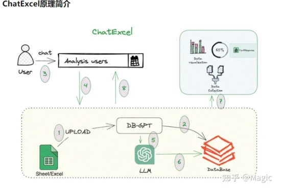 

· 首先我们需要将Excel作为一个数据源上传到DB-GPT当中。

· DB-GPT通过Excel Python支持特性将Excel表格数据转换为数据库表格，可以利用DB-GPT中的通用能力。

· 用户发起对话，通过对话进行Excel数据分析。

· 根据DB-GPT中ChatExcel场景逻辑，调用大模型生成对应的Text2SQL语句。

· 利用执行插件能力，执行具体结果。

· 收集数据绘制图表。

· 返回最终结果。

 

# **FastChat框架源码解析之controller.py（大模型调度原理）**

用于训练、服务和评估基于大型语言模型的聊天机器人的开放平台

1. 提供了多种模型（例如，llama,warn,Chatham,Vicuna）的权重、训练代码和评估代码。
2.  一个分布式的多模型服务系统，配备了Web用户界面和与OpenAI兼容的RESTful API。

 

## fastchat 大模型调度原理

### LOTTERY（抽奖）调度方法

### SHORTEST_QUEUE（最短队列）调度方法

总的来说，这两种调度方法都试图在工作节点之间均衡地分配任务，但它们的方法和侧重点不同。LOTTERY方法侧重于工作节点的速度，而SHORTEST_QUEUE方法侧重于工作节点的当前负载。

 

## 源码解析

### controller.py整体架构解析

[controller.py](https://link.zhihu.com/?target=http://controller.py/)是一个使用FastAPI框架的服务器应用，其主要目的是管理和调度多个工作节点（或称为工作器）。这些工作节点可以理解为运行特定模型的服务器实例。以下是对代码的详细解析：

1. 导入模块：代码开始时导入了一系列必要的模块，如`argparse`用于命令行参数解析，`asyncio`用于异步操作，`dataclasses`用于数据类，`fastapi`用于API服务器等。

2. 日志设置：使用`build_logger`函数从`fastchat.utils`创建一个日志记录器。

3. 调度方法枚举：定义了一个`DispatchMethod`枚举，它有两个值：`LOTTERY`和`SHORTEST_QUEUE`，分别表示两种不同的工作节点选择策略。

4. 工作节点信息数据类：`WorkerInfo`数据类用于存储工作节点的信息，如模型名称、速度、队列长度等。

5. 心跳控制器：`heart_beat_controller`函数是一个无限循环，用于定期检查工作节点的心跳并删除过期的工作节点。

6. Controller类：

```
- `__init__`：初始化函数中，创建一个空的工作节点信息字典和一个心跳线程。
- `register_worker`：注册或更新工作节点的信息。
- `get_worker_status`：从工作节点获取其状态。
- `remove_worker`：从注册列表中删除工作节点。
- `refresh_all_workers`：刷新所有工作节点的状态。
- `list_models`：列出所有可用模型。
- `get_worker_address`：根据选择的调度方法返回一个工作节点地址。
- `receive_heart_beat`：接收工作节点的心跳并更新其状态。
- `remove_stale_workers_by_expiration`：删除过期的工作节点。
- `handle_no_worker`和`handle_worker_timeout`：处理没有工作节点或工作节点超时的情况。
- `worker_api_get_status`和`worker_api_generate_stream`：允许控制器作为工作节点来获取状态或生成数据流。
```

7. FastAPI应用：定义了一个FastAPI应用和一系列API端点，如`register_worker`、`refresh_all_workers`、`list_models`等。

8. create_controller函数：解析命令行参数并创建一个控制器实例

9. 主执行部分：如果这个脚本是主程序，则创建一个控制器并运行FastAPI应用。

 

 

 

# **参考**

[表格解析手册](https://kg-nlp.github.io/Algorithm-Project-Manual/表格解析/)

[FastChat](https://github.com/lm-sys/FastChat)

[FastChat框架源码解析之controller.py（大模型调度原理）](https://zhuanlan.zhihu.com/p/656506047)

[FastChat 大模型推理服务](https://zhuanlan.zhihu.com/p/657831160)

[FastChat-Vicuna开放，媲美ChatGPT的90%能力——从下载到安装、部署](https://blog.csdn.net/alionsss/article/details/130027299)

[FastChat——一个用于训练、部署和评估基于大型语言模型的聊天机器人的开放平台](https://cloud.tencent.com/developer/article/2297923)

 

[DB-GPT中文文档](https://db-gpt.readthedocs.io/projects/db-gpt-docs-zh-cn/zh_CN/latest/index.html)

[DB-GPT: 用私有化LLM技术定义数据库下一代交互方式](https://github.com/eosphoros-ai/DB-GPT/blob/main/README.zh.md)

[【eosphoros-ai】例会摘要(一)：DB-GPT架构介绍及部分核心代码讲解](https://www.bilibili.com/video/BV15r4y1d79a/?spm_id_from=333.1007.top_right_bar_window_custom_collection.content.click&vd_source=a9f595e4b26bcb66fef9c3acae4fc4fd)

[92%的准确率！如何利用DB-GPT在业务场景下打造企业级的知识库问答系统](https://www.bilibili.com/video/BV1sN411J7cv/?spm_id_from=333.1007.top_right_bar_window_custom_collection.content.click&vd_source=a9f595e4b26bcb66fef9c3acae4fc4fd)

 

 

DB-GPT作者之一 Magic

[LLM实战系列(1)—强强联合Langchain-Vicuna应用实战](https://zhuanlan.zhihu.com/p/628750042)

[DB-GPT: 一个隐私的数据库垂直领域本地化大模型框架](https://zhuanlan.zhihu.com/p/629998078)

[垂域LLM应用实践](https://zhuanlan.zhihu.com/p/639359512)

[DB-GPT在WAIC大会的分享整理](https://zhuanlan.zhihu.com/p/642443023)

[基于DB-GPT与Google Bard构建知识库问答系统](https://zhuanlan.zhihu.com/p/647270538)

[ChatExcel-通过自然语言对话实现数据分析](https://zhuanlan.zhihu.com/p/653143207)

[结合大模型与数据我们能做啥？](https://zhuanlan.zhihu.com/p/662467121)

 

 

 

 

 

 

 

 

 

 

 

 

 

 

 

 

 

 

 

 

 

 

 

 

 

 

 

 

 

 

 