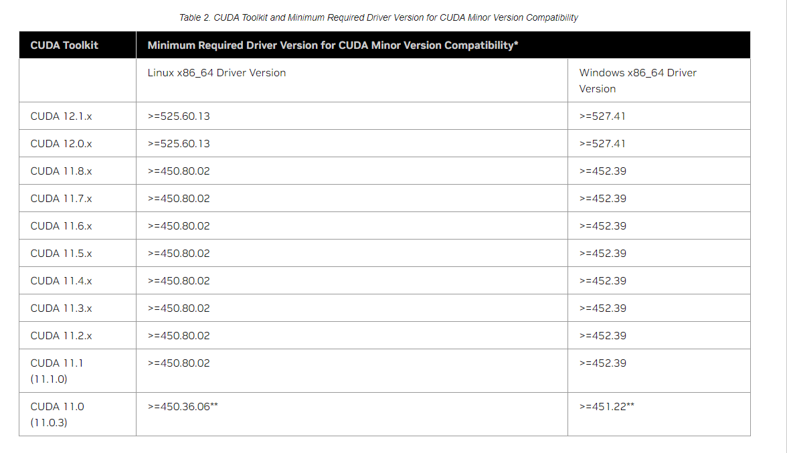
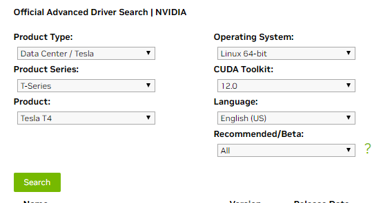

# 框架环境


* [算法开发手册](https://kg-nlp.github.io/Algorithm-Project-Manual/算法框架/框架环境)

* [个人知乎](https://zhihu.com/people/zhangyj-n)


## Pytorch

[pytorch-docker](https://github.com/cnstark/pytorch-docker)

### pytorch 1.7.0

> 算法框架的基础镜像

> 这个版本的cuda无法满足A800的显卡使用要求

```bash
docker run -it -d --name pytorch_env -p 8085:22 -p 8040:8040 -p 8030:8030 -p 8020:8020 --gpus all --shm-size 64g --restart=always pytorch/pytorch:1.7.0-cuda11.0-cudnn8-devel /bin/bash

apt-get update
apt-get install -y vim
apt-get install -y openssh-server
service ssh restart
root@b9d22b100490:/opt/conda/bin# ln -s /opt/conda/bin/python /usr/local/bin/python
root@b9d22b100490:/opt/conda/bin# ln -s /opt/conda/bin/pip /usr/local/bin/pip
```

> 设置容器启动时自动开启ssh服务

```bash
# 找到并打开文件/root/.bashrc
$ vim /root/.bashrc
# 在.bashrc末尾添加如下代码
$ service ssh start
```

> 重新commit 以及启动,启动时注意外挂数据卷,以及多暴露端口

```bash
docker commit pytorch_env registry.cn-beijing.aliyuncs.com/zhangyj-n/pytorch:1.7.0-cuda11.0-cudnn8-devel

docker run -it -d --name pytorch_env -p 8085:22  -p 8086:8086 -p 8087:8087 -p 8088:8088 -p 8089:8089 -p 8084:8084 \
-v /home/zhangyj/Algorithm_Frame:/home/Algorithm_Frame \
--shm-size 64g --restart=always --gpus all  -e NVIDIA_VISIBLE_DEVICES=all registry.cn-beijing.aliyuncs.com/zhangyj-n/pytorch:1.7.0-cuda11.0-cudnn8-devel /bin/bash
```


>  如果缺少动态库,参考工程内容 [🔨开发问题](https://kg-nlp.github.io/Algorithm-Project-Manual/工程内容/开发问题.html)

```bash
示例:
find / -name libcudart.so.10.2
/usr/local/cuda-10.2/targets/x86_64-linux/lib/libcudart.so.10.2
拷贝至 /usr/lib/ 
```


### pytorch 1.13.0

* smp比赛镜像制作,custom环境

```bash
基于上面1.7.0开发,c++版本还是有些低了
registry.cn-beijing.aliyuncs.com/zhangyj-n/pytorch:1.13.0-cuda11.0-cudnn8-simple
docker run -it -d --name smp_env --gpus all  -e NVIDIA_VISIBLE_DEVICES=all registry.cn-beijing.aliyuncs.com/zhangyj-n/pytorch:1.13.0-cuda11.0-cudnn8-simple /bin/bash

docker exec -it smp_env bash  # 进入容器
apt-get update
apt-get install -y vim
apt-get install -y openssh-server  # 安装ssh服务
vi /etc/ssh/sshd_config  # 修改ssh配置文件如下(全部替换)
ggdG
"""
ChallengeResponseAuthentication no
UsePAM yes
X11Forwarding yes
PrintMotd no
AcceptEnv LANG LC_*
Subsystem    sftp    /usr/lib/openssh/sftp-server
PubkeyAuthentication yes
RSAAuthentication yes
PermitRootLogin yes
"""

service ssh restart  # 启动
passwd root  # 修改密码
root
cat /etc/passwd

root@b9d22b100490:/opt/conda/bin# ln -s /opt/conda/bin/python /usr/local/bin/python
root@b9d22b100490:/opt/conda/bin# ln -s /opt/conda/bin/pip /usr/local/bin/pip

which python  # 查找python解析器路径,使用pycharm远程连接时需要

apt-get install curl -y
apt-get install zip -y
apt-get install unzip -y
```

> 设置容器启动时自动开启ssh服务
```bash
# 找到并打开文件/root/.bashrc
$ vim /root/.bashrc
# 在.bashrc末尾添加如下代码
$ service ssh start
```

>  生成新镜像

```bash
docker commit -m 'update' registry.cn-beijing.aliyuncs.com/zhangyj-n/pytorch:1.13.0-cuda11.0-cudnn8-0823
```


> 已安装pip

```tex
transformers==4.31.0
modelscope==1.8.3
numpy==1.20.3
sentencepiece
torch==1.13.0
accelerate==0.21.0

python-docx==0.8.11
fastapi==0.101.1
openpyxl==3.1.2

elasticsearch==7.10.1
pymilvus==1.1.2
faiss-gpu==1.7.2
pdfplumber==0.10.2
pandas==2.0.3
```


> 启动

```bash
docker run -it -d --name custom_env \
-p 8015:22  -p 8001:8001 -p 8002:8002 -p 8003:8003 -p 8004:8004 -p 8005:8005 \
-v /data/zhangyj/custom_project:/workspace/custom_project \
--gpus all --shm-size 64g --restart=always \
-e NVIDIA_VISIBLE_DEVICES=all \
registry.cn-beijing.aliyuncs.com/zhangyj-n/pytorch:1.13.0-cuda11.0-cudnn8-0823 /bin/bash
```


* 在pytorch环境中安装paddle后再使用visualdl可视化日志

```bash
which visualdl
find / -name visualdl

# 创建软链接
ln -s /opt/conda/bin/visualdl /usr/local/bin/visualdl 

# 正常启动方式
/opt/conda/bin/visualdl --logdir=/home/Algorithm_Frame/LLM/ernie-1.0/output/ernie-3.0-micro-zh/runs/ --host= 0.0.0.0 --port=8010   打不开试试下面

# 上述无法打开,直接运行log文件
visualdl service upload --logdir ./runs/

# streamlit前端
ln -s /opt/conda/bin/streamlit /usr/local/bin/streamlit
```


## Paddle

### paddle:2.4.1

在A800无法运行,cuda不兼容

```bash
docker run -it -d --name paddle_env -p 8075:22 -v /home/zhangyj/EngineeringField/CDE:/home/EngineeringField/CDE --gpus all --shm-size 64g --restart=always -e NVIDIA_DRIVER_CAPABILITIES=compute,utility -e NVIDIA_VISIBLE_DEVICES=all paddlepaddle/paddle:2.4.1-gpu-cuda10.2-cudnn7.6-trt7.0 /bin/bash


远程访问 查看 上述链接（重点）
docker exec -it paddle_env bash
apt-get install openssh-server
service ssh restart

# 如果没有配置root密码时需要进行的操作
passwd root
root
cat /etc/passwd

pip install paddle_serving_app paddle_serving_client
pip install paddle-serving-server-gpu==0.8.3.post102 -i https://pypi.tuna.tsinghua.edu.cn/simple

which visualdl
find / -name visualdl
ln -s /usr/local/python3.7.0/bin/visualdl /usr/local/bin/visuadl
visualdl --logdir=./runs/ --port=8040

docker commit paddle_env registry.cn-beijing.aliyuncs.com/zhangyj-n/paddle:2.4.1-gpu-cuda10.2-cudnn7.6-trt7.0-20230223

docker run -it -d --name paddle_env_20230223 -p 8075:22 -p 8071:8071 -p 8072:8072 -p 8073:8073 -p 8874:8874 -v /home/zhangyj/EngineeringField/CDE:/home/EngineeringField/CDE --gpus all --shm-size 64g --restart=always -e NVIDIA_DRIVER_CAPABILITIES=compute,utility -e NVIDIA_VISIBLE_DEVICES=all registry.cn-beijing.aliyuncs.com/zhangyj-n/paddle:2.4.1-gpu-cuda10.2-cudnn7.6-trt7.0-20230223
```


### paddle:2.5.0


```bash
docker run -it -d --name paddle_env -p 8075:22 -p 18040:18040 -p 18030:18030 -p 18020:18020 -p 18010:18010  -v /data/zhangyj/CDE:/home/zhangyj/CDE --gpus all --shm-size 64g --restart=always -e NVIDIA_DRIVER_CAPABILITIES=compute,utility -e NVIDIA_VISIBLE_DEVICES=all paddlepaddle/paddle:2.5.0-gpu-cuda11.7-cudnn8.4-trt8.4 /bin/bash

切换阿里源 
apt-get update

远程访问 查看 上述链接（重点）
docker exec -it paddle_env bash
apt-get install -y openssh-server
service ssh restart

# 如果没有配置root密码时需要进行的操作
passwd root
root
cat /etc/passwd

pip install paddle_serving_app paddle_serving_client
pip install paddle-serving-server-gpu==0.8.3.post112 -i https://pypi.tuna.tsinghua.edu.cn/simple

which visualdl
find / -name visualdl

ln -s /usr/local/python3.7.0/bin/visualdl /usr/local/bin/visuadl
visualdl --logdir=./runs/ --port=8040

vim /root/.bashrc
service ssh start


docker commit paddle_env registry.cn-beijing.aliyuncs.com/zhangyj-n/paddle:2.5.0-gpu-cuda11.7-cudnn8.4-trt8.4

docker run -it -d --name paddle_env -p 8075:22 -p 8076:8076 -p 8077:8077 -p 8079:8079 -p 8074:8074  -v /data/zhangyj/CDE:/home/zhangyj/CDE --gpus all --shm-size 64g --restart=always -e NVIDIA_DRIVER_CAPABILITIES=compute,utility -e NVIDIA_VISIBLE_DEVICES=all registry.cn-beijing.aliyuncs.com/zhangyj-n/paddle:2.5.0-gpu-cuda11.7-cudnn8.4-trt8.4 /bin/bash
```


## pytorch-paddle

### ==paddle_torch:base-1.13.0-2.4.2-11.7==

```
docker run -it -d --name test_env --gpus all -e NVIDIA_VISIBLE_DEVICES=all cnstark/pytorch:1.13.0-py3.9.12-cuda11.7.1-devel-ubuntu20.04 /bin/bash

docker exec -it test_env bash  # 进入容器

pip install pip -U

ubuntu更新清华源
vi /etc/apt/sources.list
apt-get update

apt-get install -y vim
apt-get install -y openssh-server  # 安装ssh服务
vi /etc/ssh/sshd_config  # 修改ssh配置文件如下(全部替换)
ggdG
"""
ChallengeResponseAuthentication no
UsePAM yes
X11Forwarding yes
PrintMotd no
AcceptEnv LANG LC_*
Subsystem    sftp    /usr/lib/openssh/sftp-server
PubkeyAuthentication yes
RSAAuthentication yes
PermitRootLogin yes
"""

# 找到并打开文件/root/.bashrc
$ vim /root/.bashrc
# 在.bashrc末尾添加如下代码
$ service ssh start

service ssh restart  # 启动
passwd root  # 修改密码
root
cat /etc/passwd

which python  # 查找python解析器路径,使用pycharm远程连接时需要

root@b9d22b100490:/opt/conda/bin# ln -s /opt/conda/bin/python /usr/local/bin/python
root@b9d22b100490:/opt/conda/bin# ln -s /opt/conda/bin/pip /usr/local/bin/pip


apt-get install curl -y
apt-get install zip -y
apt-get install unzip -y

永久更新清华源
pip config set global.index-url https://pypi.tuna.tsinghua.edu.cn/simple
```


> ubuntu更新阿里云

```
阿里源
deb https://mirrors.aliyun.com/ubuntu/ focal main restricted universe multiverse
deb-src https://mirrors.aliyun.com/ubuntu/ focal main restricted universe multiverse

deb https://mirrors.aliyun.com/ubuntu/ focal-security main restricted universe multiverse
deb-src https://mirrors.aliyun.com/ubuntu/ focal-security main restricted universe multiverse

deb https://mirrors.aliyun.com/ubuntu/ focal-updates main restricted universe multiverse
deb-src https://mirrors.aliyun.com/ubuntu/ focal-updates main restricted universe multiverse

# deb https://mirrors.aliyun.com/ubuntu/ focal-proposed main restricted universe multiverse
# deb-src https://mirrors.aliyun.com/ubuntu/ focal-proposed main restricted universe multiverse

deb https://mirrors.aliyun.com/ubuntu/ focal-backports main restricted universe multiverse
deb-src https://mirrors.aliyun.com/ubuntu/ focal-backports main restricted universe multiverse


清华源
deb https://mirrors.tuna.tsinghua.edu.cn/ubuntu/ focal main restricted universe multiverse
# deb-src https://mirrors.tuna.tsinghua.edu.cn/ubuntu/ focal main restricted universe multiverse
deb https://mirrors.tuna.tsinghua.edu.cn/ubuntu/ focal-updates main restricted universe multiverse
# deb-src https://mirrors.tuna.tsinghua.edu.cn/ubuntu/ focal-updates main restricted universe multiverse
deb https://mirrors.tuna.tsinghua.edu.cn/ubuntu/ focal-backports main restricted universe multiverse
# deb-src https://mirrors.tuna.tsinghua.edu.cn/ubuntu/ focal-backports main restricted universe multiverse
deb https://mirrors.tuna.tsinghua.edu.cn/ubuntu/ focal-security main restricted universe multiverse
# deb-src https://mirrors.tuna.tsinghua.edu.cn/ubuntu/ focal-security main restricted universe multiverse multiverse
```


> 安装必要包

````
transformers==4.31.0
modelscope==1.8.3
numpy==1.20.3
sentencepiece
accelerate==0.21.0
python-docx==0.8.11
fastapi==0.101.1
openpyxl==3.1.2
elasticsearch==7.10.1
pymilvus==1.1.2
faiss-gpu==1.7.2
pdfplumber==0.10.2
pandas==2.0.3
matplotlib==3.7.2
visualdl==2.4.2
paddlenlp==2.5.2
hnswlib==0.7.0

pip install paddlepaddle-gpu==2.4.2.post117 -f https://www.paddlepaddle.org.cn/whl/linux/mkl/avx/stable.html
````


> 生成新镜像并推送,运行

```
docker commit test_env registry.cn-beijing.aliyuncs.com/zhangyj-n/paddle_torch:base-1.13.0-2.4.2-11.7

docker run -it -d --name paddle_torch_env -p 8075:22 -p 8076:8076 -p 8077:8077 -p 8079:8079 -p 8074:8074  -v /data/zhangyj/CDE:/home/zhangyj/CDE --gpus all --shm-size 64g --restart=always -e NVIDIA_DRIVER_CAPABILITIES=compute,utility -e NVIDIA_VISIBLE_DEVICES=all registry.cn-beijing.aliyuncs.com/zhangyj-n/paddle_torch:base-1.13.0-2.4.2-11.7 /bin/bash

docker run -it -d --name custom_env \
-p 8015:22  -p 8001:8001 -p 8002:8002 -p 8003:8003 -p 8004:8004 -p 8005:8005 \
-v /data/zhangyj/custom_project:/workspace/custom_project \
--gpus all --shm-size 64g --restart=always \
-e NVIDIA_VISIBLE_DEVICES=all \
registry.cn-beijing.aliyuncs.com/zhangyj-n/paddle_torch:base-1.13.0-2.4.2-11.7 /bin/bash
```


## jupyter


[docker-github](https://github.com/jupyter/docker-stacks)

[jupyter-docker-stacks](https://jupyter-docker-stacks.readthedocs.io/en/latest/using/recipes.html?highlight=password#using-sudo-within-a-container)

```bash
docker run -it -d -p 10000:8888 --user root -e GRANT_SUDO=yes --restart=always --name jupyter_data -v "${PWD}":/home/jovyan/work jupyter/datascience-notebook:85f615d5cafa
```


```bash
(base) jovyan@f43a5217f92c:~$ jupyter server list
Currently running servers:
http://24a936b38d1f:8888/?token=53325304204535831905622ab4544174b8be656f96e02ebb :: /home/jovyan

'''中间省略升级apt,安装其他服务'''

chown -Rf jovyan:users ./
```


## SSH访问

> 当启动容器后 外部无法访问时

**安装ssh**

```
apt-get install -y openssh-server

无法安装
apt-get update
```

**2.备份ssh的配置文件**

```
sudo cp /etc/ssh/sshd_config /etc/ssh/sshd_config.bak
```

**3.新装的ssh需要修改配置文件**

```
vi /etc/ssh/sshd_config
```

　　配置文件修改这几处地方　

```
ChallengeResponseAuthentication no
UsePAM yes
X11Forwarding yes
PrintMotd no
AcceptEnv LANG LC_*
Subsystem    sftp    /usr/lib/openssh/sftp-server
PubkeyAuthentication yes
RSAAuthentication yes
PermitRootLogin yes
```

**4.启动ssh**

```
service ssh start            # * Starting OpenBSD Secure Shell server sshd<br># 或者<br>/etc/init.d/ssh start        # * Starting OpenBSD Secure Shell server sshd
```

　　如果提示错误信息中包含**could not load host key** 则需要重新生成 key

```
sudo rm /etc/ssh/ssh*key # 先移除旧的key dpkg-reconfigure openssh-server
```

　　生成之后需要重启SSH服务使新的密钥生效：   

```
service ssh restart          # * Restarting OpenBSD Secure Shell server sshd<br># 或者/etc/init.d/ssh restart       # * Restarting OpenBSD Secure Shell server sshd
```

　　启动、停止和重启ssh的命令如下

```
/etc/init.d/ssh start         # * Starting OpenBSD Secure Shell server sshd /etc/init.d/ssh stop          # * Stopping OpenBSD Secure Shell server sshd /etc/init.d/ssh restart       # * Restarting OpenBSD Secure Shell server sshd
```


**5.查看服务状态**

```
service ssh status # * sshd is running  显示此内容则表示启动正常
```

**6.查看ssh是否启动**

```
ps -e | grep ssh

　　如果ssh已经启动则会提示

469 ?        00:00:00 sshd
```

**7.设置ssh开机自启动**

容器内设置

```
# 找到并打开文件/root/.bashrc
$ vim /root/.bashrc
# 在.bashrc末尾添加如下代码
$ service ssh start
```


## **内核、nvidia驱动、Cuda、cudann版本对应关系及安装**

centos :

yum更新-内核升级-与nvidia驱动不兼容

以pkm-01为例

**lspci | grep -i nvidia  查看GPU**

```
3b:00.0 3D controller: NVIDIA Corporation TU104GL [Tesla T4] (rev a1)
86:00.0 3D controller: NVIDIA Corporation TU104GL [Tesla T4] (rev a1)
af:00.0 3D controller: NVIDIA Corporation TU104GL [Tesla T4] (rev a1)
d8:00.0 3D controller: NVIDIA Corporation TU104GL [Tesla T4] (rev a1)
```

**uname -m && cat /etc/\*release**  查看环境信息

```
x86_64
CentOS Linux release 7.9.2009 (Core)
NAME="CentOS Linux"
VERSION="7 (Core)"
ID="centos"
ID_LIKE="rhel fedora"
VERSION_ID="7"
PRETTY_NAME="CentOS Linux 7 (Core)"
ANSI_COLOR="0;31"
CPE_NAME="cpe:/o:centos:centos:7"
HOME_URL="https://www.centos.org/"
BUG_REPORT_URL="https://bugs.centos.org/"

CENTOS_MANTISBT_PROJECT="CentOS-7"
CENTOS_MANTISBT_PROJECT_VERSION="7"
REDHAT_SUPPORT_PRODUCT="centos"
REDHAT_SUPPORT_PRODUCT_VERSION="7"

CentOS Linux release 7.9.2009 (Core)
CentOS Linux release 7.9.2009 (Core)
```


**gcc --version**

```
gcc (GCC) 7.3.1 20180303 (Red Hat 7.3.1-5)
Copyright (C) 2017 Free Software Foundation, Inc.
This is free software; see the source for copying conditions.  There is NO
warranty; not even for MERCHANTABILITY or FITNESS FOR A PARTICULAR PURPOSE
```


**uname -r**

内核头和内核开发包

```
3.10.0-1160.90.1.el7.x86_64
Note: If you perform a system update which changes the version of the linux kernel being used, make sure to rerun the commands below to ensure you have the correct kernel headers and kernel development packages installed. Otherwise, the CUDA Driver will fail to work with the new kernel.
```

centos 安装linux内核头和内核开发包

**cuda toolkit**

```
distribution-specific packages (RPM and Deb packages), 
or a distribution-independent package (runfile packages)
```

倾向使用前者

```
The libcuda.so library is installed in the /usr/lib{,64}/nvidia directory. For pre-existing projects which use libcuda.so, it may be useful to add a symbolic link from libcuda.so in the /usr/lib{,64} directory.
```

**NVIDIA CUDA Toolkit Release Notes**

[cuda版本和nvidia内核版本](https://docs.nvidia.com/cuda/cuda-toolkit-release-notes/index.html)



```
wget https://developer.download.nvidia.com/compute/cuda/12.1.1/local_installers/cuda-repo-rhel7-12-1-local-12.1.1_530.30.02-1.x86_64.rpm
sudo rpm -i cuda-repo-rhel7-12-1-local-12.1.1_530.30.02-1.x86_64.rpm
sudo yum clean all
sudo yum -y install nvidia-driver-latest-dkms
sudo yum -y install cuda
```


[**cuda驱动**](https://www.nvidia.com/Download/Find.aspx)




到好的环境中查看linux内核版本,查看nvidia驱动版本,查看cuda版本

[**https://blog.csdn.net/A15216110998/article/details/113402172**](https://blog.csdn.net/A15216110998/article/details/113402172)  **这个文件不错**

根据教程

第二步，使用nvcc -V检查驱动和cuda

```
nvcc: NVIDIA (R) Cuda compiler driver
Copyright (c) 2005-2021 NVIDIA Corporation
Built on Sun_Feb_14_21:12:58_PST_2021
Cuda compilation tools, release 11.2, V11.2.152
Build cuda_11.2.r11.2/compiler.29618528_0
```

第三步，查看已安装驱动的版本信息

```
ls /usr/src | grep nvidia
nvidia-530.30.02
```

docker run gpu 无法使用是,记得装nvidia-container-runtime

```
安装NVIDIA-CONTAINER-RUNTIME
在https://nvidia.github.io/nvidia-container-runtime/查看支持的操作系统和版本，并根据对应选项，添加源，因为我是centos7，所以添加方式为：

distribution=$(. /etc/os-release;echo $ID$VERSION_ID)
curl -s -L https://nvidia.github.io/nvidia-container-runtime/$distribution/nvidia-container-runtime.repo | \
sudo tee /etc/yum.repos.d/nvidia-container-runtime.repo

然后直接yum install 就可以了
sudo yum install nvidia-container-runtime
进行测试，如果能成功出现显卡信息就可以了

sudo systemctl restart docker

docker run -it --rm --gpus all centos nvidia-smi
```

**安装完后再重启  sudo reboot**


## conda环境配置


**Linux下安装miniconda**

https://blog.csdn.net/m0_46336568/article/details/127836072

```
#第一步下载miniconda安装包 
#安装包连接https://mirrors.tuna.tsinghua.edu.cn/anaconda/miniconda/，查找相应安装包
wget -c https://mirrors.tuna.tsinghua.edu.cn/anaconda/miniconda/Miniconda3-py39_4.9.2-Linux-x86_64.sh
#第二步安装
bash Miniconda3-py39_4.9.2-Linux-x86_64.sh
#第三部配置conda镜像
source ~/.bashrc
conda config --add channels https://mirrors.tuna.tsinghua.edu.cn/anaconda/pkgs/free
conda config --add channels https://mirrors.tuna.tsinghua.edu.cn/anaconda/cloud/conda-forge
conda config --add channels https://mirrors.tuna.tsinghua.edu.cn/anaconda/cloud/bioconda
conda config --set show_channel_urls yes
#第四步创建一个名称为python38的环境，python版本等于3.8
conda create -n tf2.3torch1.7 python=3.8
conda create -n paddle_env python=3.8
#第五步 激活环境
source activate python38
```


**创建用户和密码**

```
useradd zhangyj
passwd zhangyj
zhangyj-n  zhangyj-n
接下来安装pip包
```


**配置源**

```
# 设置conda命令启动
vi ~/.bashrc
内容如下
export PATH=/home/zhangyj/miniconda3/bin/:$PATH


#设置pip清华源
#用户的文件夹下新建目录.pip，并在目录新建配置文件pip.conf
#命令
mkdir ~/.pip
cd ~/.pip
vi pip.conf
内容如下
[global]
index-url=https://pypi.tuna.tsinghua.edu.cn/simple
[install]
trusted-host=pypi.tuna.tsinghua.edu.cn
disable-pip-version-check = true
timeout = 6000
```


**导出虚拟环境pip包**

```
conda install -n env_name python=3.7

pip批量导出包含环境中所有组件的requirements.txt文件
pip freeze > requirements.txt

pip批量安装requirements.txt文件中包含的组件依赖
pip install -r requirements.txt

conda批量导出包含环境中所有组件的requirements.txt文件
conda list -e > requirements.txt

conda批量安装requirements.txt文件中包含的组件依赖
conda install --yes --file requirements.txt
```


## python 安装


### Python3.7

```
安装python & python安装
centos安装python3
1) 首先安装依赖包
 yum -y install zlib-devel bzip2-devel openssl-devel ncurses-devel sqlite-devel readline-devel tk-devel gdbm-devel db4-devel libpcap-devel xz-devel libffi-devel
2) 下载python3安装包
[root@python tools]# wget https://www.python.org/ftp/python/3.7.4/Python-3.7.4.tgz
3) 解压
[root@python tools]# tar xvzf Python-3.7.4.tgz 
tar xvzf Python-3.7.4.tgz
4) 创建文件夹把python3安装在里面
[root@python tools]# mkdir -p /usr/local/python3.7.4
[root@python tools]# cd Python-3.7.4
[root@python Python-3.7.4]# ./configure --prefix=/usr/local/python3.7.4/
[root@python Python-3.7.4]# make && make install
5) 建立软连接
[root@python Python-3.7.4]# ln -s /usr/local/python3.7.4/bin/python3.7 /usr/bin/python3
[root@python Python-3.7.4]# ln -s /usr/local/python3.7.4/bin/pip3.7 /usr/bin/pip3
 ln -s /usr/local/python3.7.4/bin/python3.7 /usr/local/bin/python 3
 ln -s /usr/local/python3.7.4/bin/pip3.7 /usr/local/bin/pip3
6) 验证和测试
[root@python Python-3.7.4]# python3.7.4
Python 3.7.4 (default, Jul 26 2019, 04:16:54) 
[GCC 4.8.5 20150623 (Red Hat 4.8.5-36)] on linux
Type "help", "copyright", "credits" or "license" for more information.
>>>
```

```
 原容器自带软连接
 ln -s /usr/local/python3.7.0/bin/python3.7 /usr/bin/python
 ln -s /usr/local/python3.7.0/bin/pip3.7 /usr/bin/pip
 
 ln -s /usr/local/python3.7.0/bin/python3.7 /usr/local/bin/python 
 ln -s /usr/local/python3.7.0/bin/pip3.7 /usr/local/bin/pip
```


### Python3.8

**3.8.8 还没测试过**

```
2) 下载python3安装包
wget https://www.python.org/ftp/python/3.8.8/Python-3.8.8.tgz
3) 解压
tar xvzf Python-3.8.8.tgz
4) 创建文件夹把python3安装在里面
mkdir -p /usr/local/python3
cd Python-3.8.8
./configure --prefix=/usr/local/python3/
make && make install
5) 建立软连接
[root@python Python-3.8.8]# ln -s /usr/local/python3/bin/python3.7 /usr/bin/python3
[root@python Python-3.8.8]# ln -s /usr/local/python3/bin/pip3.7 /usr/bin/pip3
6) 验证和测试
[root@python Python-3.8.8]# python3
Python 3.7.4 (default, Jul 26 2019, 04:16:54) 
[GCC 4.8.5 20150623 (Red Hat 4.8.5-36)] on linux
Type "help", "copyright", "credits" or "license" for more information.
>>>
```


